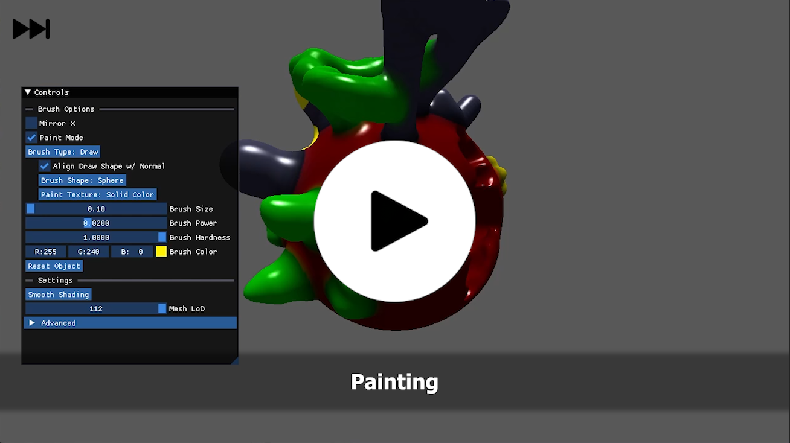
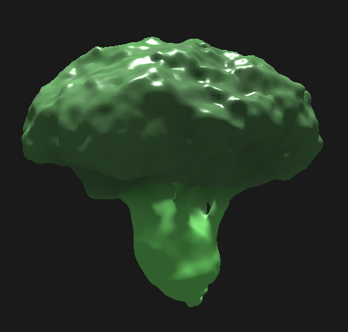
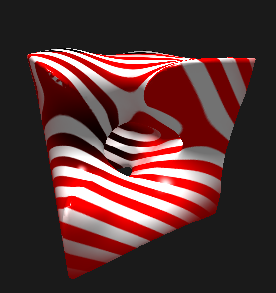
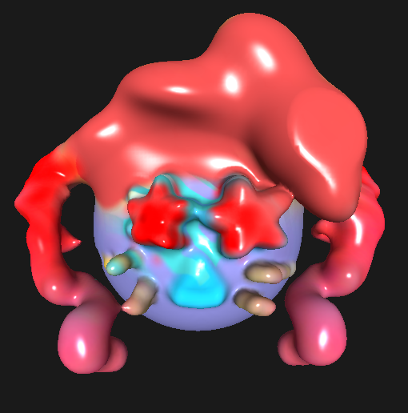
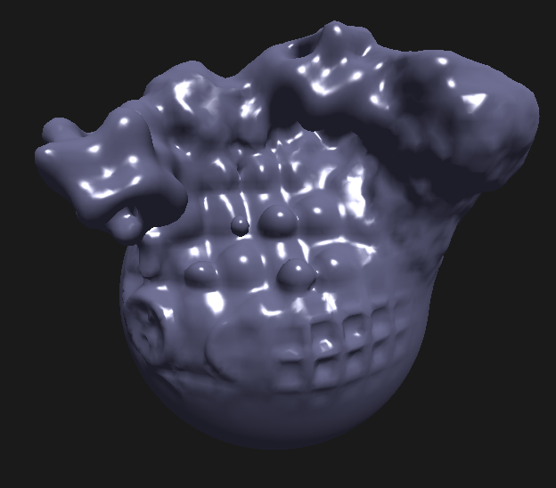
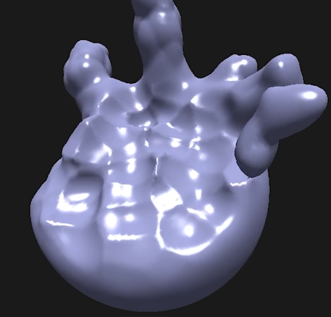
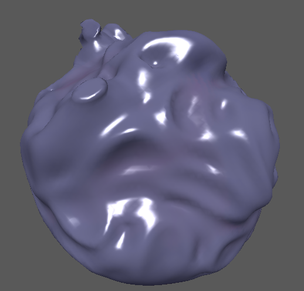
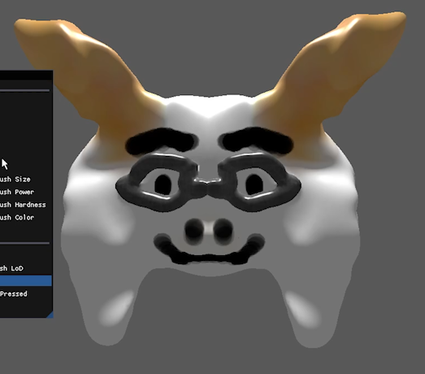

## Design Document:

#### Introduction
I plan to create a sculpting tool using marching cubes and WebGPU.  I'm motivated to explore marching cubes in a sculpting context and create a fun tool.

#### Goal
I intend to create a simple sculpting tool in WebGPU that can be used on the web.

#### Inspiration/reference:
- [This Terraforming video by Sebastion Lague](https://www.youtube.com/watch?v=vTMEdHcKgM4)
- [This Marching Squares Article by Jamie Wong](https://jamie-wong.com/2014/08/19/metaballs-and-marching-squares/)
- [Astroneer](http://store.steampowered.com/app/361420/ASTRONEER/), a game that makes heavy use of terraforming.

#### Specification:
I plan on the project featuring a draw brush that allows for the creation of geometry as well as a subtract brush that deletes geometry.  I hope to have different types of brushes as well.  I may also allow the user to use different visual materials.

#### Techniques:
I will almost definitely use marching cubes, but I may use other techniques that I'm not currently aware of.

#### Design:

#### Timeline:
- Week 1: Setup WebGPU, Research Terraforming/Sculpting, Implement Basic Marching Cubes
- Week 2: Finish/fix implementation if necessary, add basic sculpting
- Week 3: Troubleshoot, add UI and a few different brushes
- Week 4: Polish, troubleshoot, test building, and potentially add different visual materials

Submit your Design doc as usual via pull request against this repository.

## Milestone 1:

For this milestone, I mostly just setup WebGPU and classes for drawing and using compute shaders with it.  Setting up and learning WebGPU took me more time than I expected.  

## Milestone 2:

For this milestone, I set up compute shaders for generating and updating the 3D scalar field as well as compute shaders for generating the mesh from the field (marching cubes) and a compute shader for raycasting to the surface.  The user can edit geometry with their mouse.  

https://github.com/user-attachments/assets/c61c4dfe-7189-4275-b309-5f1b5789c22c

I plan on adding UI for changing the brush size and power, as well as adding color and smooth normals.  I plan on having extra operations like mirror, twist around an axis, and sdf-like domain repetition.  I'm not sure if I'll have time to add the sdf-like operations for the final submission.

## Final Submission:

### Final Results

[Slideshow Version](https://docs.google.com/presentation/d/1K8j5KwaZzlcoo3jWt414LCfCrM3Et9RGUvkCsfZc7_M/edit?usp=sharing)

#### Overview

The final result is a sculpting tool made with WebGPU and C++.  The user is able to use a variety of brushes and operations to sculpt their model.  All of the mesh operations are done with compute shaders.

#### Implementation Details

The model the user creates is represented by a 3D scalar field in a 3D texture.  From the 3D texture, we create a mesh using marching cubes implemented inside a compute shader.  Every edit the user makes is to the 3D scalar field, which then changes the mesh generated.

#### Functionality

Because the model is represented with a scalar field, we can take advantage of SDF-like brushes and operations.  The user can use different brush shapes like a sphere, cube, and cone; as well as more procedural shapes like sphere fractal, gyroid, voronoi… etc.  There’s also a mirror mode and a twisting brush.

#### Possible Future Features

- Brushes & Operations
  - A stretching operation that allows the user to click and drag geometry to stretch it.
  - Brush that makes pipes/other repeated objects (different types of skin, fur, grass, or fabric)
  - Can draw roughness/metallic as well as albedo (maybe PBR)
- Optimizations
  - Divide the mesh into 3D chunks and only regenerate the part of the mesh that’s changed.  
  - Only dispatch the scalar field updating compute shader in places where there’ll be changes.

### Post Mortem

I was able to accomplish most of my goals within the timespan.  Learning WebGPU took more time than I thought, but setting up the compute shaders took less time than I thought.  This project was fun to work on, especially the sculpting and painting brushes.